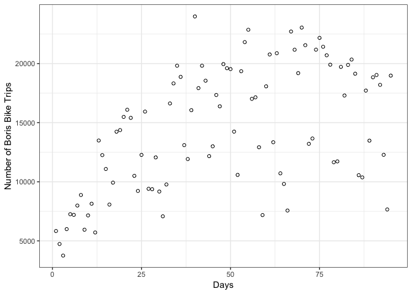
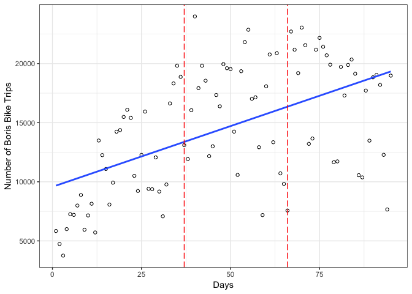

```
## ── Attaching packages ───────────────────────────────────────────────────────────────── tidyverse 1.2.1 ──
```

```
## ✔ ggplot2 3.1.0       ✔ purrr   0.3.1  
## ✔ tibble  2.0.1       ✔ dplyr   0.8.0.1
## ✔ tidyr   0.8.3       ✔ stringr 1.4.0  
## ✔ readr   1.3.1       ✔ forcats 0.4.0
```

```
## ── Conflicts ──────────────────────────────────────────────────────────────────── tidyverse_conflicts() ──
## ✖ dplyr::filter() masks stats::filter()
## ✖ dplyr::lag()    masks stats::lag()
```

```
## Loading required package: carData
```

```
## 
## Attaching package: 'car'
```

```
## The following object is masked from 'package:dplyr':
## 
##     recode
```

```
## The following object is masked from 'package:purrr':
## 
##     some
```

### Read in the data


```r
boris_data <- read_csv("boris_data.txt")
```

```
## Parsed with column specification:
## cols(
##   start_date = col_character(),
##   duration_sec = col_double(),
##   t_trip = col_double(),
##   duration_min = col_double(),
##   time = col_double(),
##   time1 = col_double(),
##   time2 = col_double(),
##   t0_int = col_double(),
##   t1_int = col_double(),
##   t2_int = col_double()
## )
```

### Creating dichotomous variables to assess the immediate impact of the tube strike

### Key dates that we need for the analysis are the tube strikes

1. September 6, 2010
2. October 4, 2010

The first strike happened at time 39 (September 6, 2010) so we need to create a variable that is 0 before time 39, 1 between time 39 and 65, and 0 again after time 65.

```r
boris_data <- boris_data %>%
               mutate(strike1 = case_when(
                 time < 39 ~ 0,
                 time > 66 ~ 0,
                 TRUE ~ 1
               ))
```

The second strike happened at time 65 (October 4, 2010) so we need to create a variable that is 1 before time 65 and 0 after after time 65.

```r
boris_data <- boris_data %>%
               mutate(strike2 = case_when(
                 time > 66 ~ 1,
                 TRUE ~ 0
               ))
```

#### Creating continuous variables to assess the change in impact over time

Creating a variable that is 0 before the first ban and linear after the first ban


```r
boris_data <- boris_data %>%
               mutate(slope2 = case_when(
                 time > 38 ~ time-38,
                 TRUE ~ 0
               ))
```

Creating a variable that is 0 before the second ban and linear after the second ban


```r
boris_data <- boris_data %>%
               mutate(slope3 = case_when(
                 time > 66 ~ time-66,
                 TRUE ~ 0
               ))
```

Creating a categorical variable that defines each strike period (i.e., pre, strike1 and strike 2). This is mostly to simply our life when graphing. 


```r
boris_data <- boris_data %>%
               mutate(strike = case_when(
                 time < 39 ~ 0,
                 time > 38 & time < 67 ~ 1, 
                 time > 66 ~ 2
               ))
```

### Some simple scatter plots analysis

Scatter plot of the Date (x-axis) and Total number of trips (y-axis). Make sure the data is sorted by Date.


```r
library(ggplot2)
ggplot(boris_data, aes(x=time, y=t_trip)) +
    geom_point(shape=1) + 
  xlab("Days") +
  ylab("Number of Boris Bike Trips") +
  theme_bw()
```

<!-- -->

Scatter plot of the Date (x-axis) and Total number of trips (y-axis) adding the linear fit (blue) and dashed red lines to represent the two strikes.


```r
ggplot(boris_data, aes(x=time, y=t_trip)) +
    geom_point(shape=1) +
    stat_smooth(method="lm", se=FALSE) +
    geom_vline(xintercept = 37, colour="red", linetype = "longdash") +
    geom_vline(xintercept = 66, colour="red", linetype = "longdash") + 
  xlab("Days") +
  ylab("Number of Boris Bike Trips") +
  theme_bw()
```

<!-- -->

#### Regression of each of the newly created variables on the total number of trips

Regression equation: 

$$ ŷ =β_0+β_1Time1+β_2Strike1+β_3Slope2+β_4Strike2+β_5Slope3+ε $$


```r
trip_reg <- lm(t_trip ~ time + strike1 + slope2 + strike2 + slope3, data = boris_data)
summary(trip_reg)
```

```
## 
## Call:
## lm(formula = t_trip ~ time + strike1 + slope2 + strike2 + slope3, 
##     data = boris_data)
## 
## Residuals:
##    Min     1Q Median     3Q    Max 
##  -7828  -2613     94   2942   7007 
## 
## Coefficients:
##             Estimate Std. Error t value Pr(>|t|)    
## (Intercept)   5889.7     1240.8    4.75  7.9e-06 ***
## time           254.7       55.5    4.59  1.4e-05 ***
## strike1       3864.5     1882.1    2.05  0.04299 *  
## slope2        -465.1      103.8   -4.48  2.2e-05 ***
## strike2      11292.7     3081.8    3.66  0.00042 ***
## slope3         -22.2      120.9   -0.18  0.85456    
## ---
## Signif. codes:  0 '***' 0.001 '**' 0.01 '*' 0.05 '.' 0.1 ' ' 1
## 
## Residual standard error: 3750 on 89 degrees of freedom
## Multiple R-squared:  0.519,	Adjusted R-squared:  0.492 
## F-statistic: 19.2 on 5 and 89 DF,  p-value: 6.67e-13
```

Interpretation of the coefficients is as follows:

* Beta0 (Intercept) – Value of dependent variable at baseline
* Beta1 (time1) - Trend prior to 1st intervention implementation
* Beta2 (strike1) - Difference between the last point prior and first point post the 1st intervention implementation
* Beta3 (slope2) – Change in trend from pre to post 1st implementation
* Beta4 (strike2) - Difference between last point in 1st implementation period and first point in 2nd implementation period
* Beta5 (slope3) – Change in trend from 1st to 2nd implementation periods


#### Getting predicted values from the regression and merging them to the "boris_data"" data set 

```r
trip_hat <- fitted(trip_reg) # predicted values
boris_data$trip_hat <- fitted(trip_reg)
```

#### Getting residual values from the regression and mergning them to the "boris_data"" data set 

```r
trip_resid <- residuals(trip_reg) # residuals
boris_data$trip_resid <- (trip_resid)
```

### Graph the regression plot

```r
ggplot(boris_data, aes(x=time, y=t_trip)) +
    geom_point(shape=1) +
    geom_smooth(aes(group=strike), method="lm", se=FALSE) +
    geom_vline(xintercept = 38, colour="red", linetype = "longdash") +
    geom_vline(xintercept = 66, colour="red", linetype = "longdash") + 
  xlab("Days") +
  ylab("Number of Boris Bike Trips") +
  theme_bw()
```

<!-- -->

Notes. The plot is a new linear model for each strike period. It is mostly for descriptive purposes. Including CI's in this graph is incorrect as they will be based on the actual model but rather the model used in the graph. That's why I've set the "se=FALSE." 


### Model fit diagnostics

#### Fitted residuals, Normal Q-Q plot

```r
opar <- par(mfrow = c(2, 2), oma = c(0, 0, 1.1, 0))
plot(trip_reg, las = 1)
```

<!-- -->

#### The Durbin-Watson statistic is a simple numerical method for checking serial dependence.

If the Durbin–Watson statistic is substantially less than 2, there is evidence of positive serial correlation. As a rough rule of thumb, if Durbin–Watson is less than 1.0, there may be cause for alarm. Small values of d indicate successive error terms are, on average, close in value to one another, or positively correlated.

```r
durbinWatsonTest(trip_reg)
```

```
##  lag Autocorrelation D-W Statistic p-value
##    1            0.28           1.4       0
##  Alternative hypothesis: rho != 0
```


```r
#library(segmented)
```

### Additional notes

* We could easily add non linear terms (e.g., quadratic) to the models by squaring or cubing the time, slope2 and slope 3 variables. This might help with model fit.
* My guess is that there is likely a weekend/weekday autocorrelation. We could add a weekend/weekday dummy variable, which would likely improve model fit.
* If serial autocorrelation continus to be a problem (after adding weekend/weekday variable) we could add Auto-Regressive Integrated Moving Average (ARIMA) components to the model.
* There is a package designed for interrupted time series regression in R. I have purposefully not shown this package because it is better to understand the model running the analysis the "manual" way.
